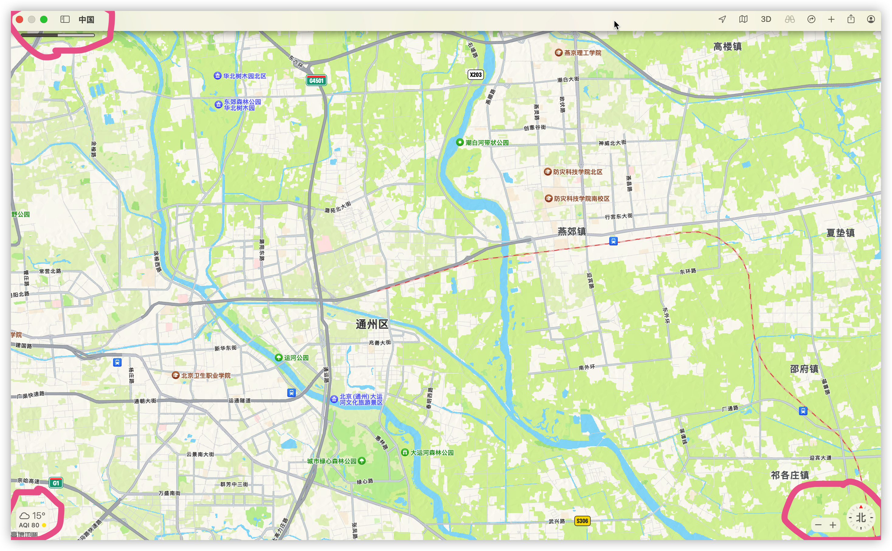
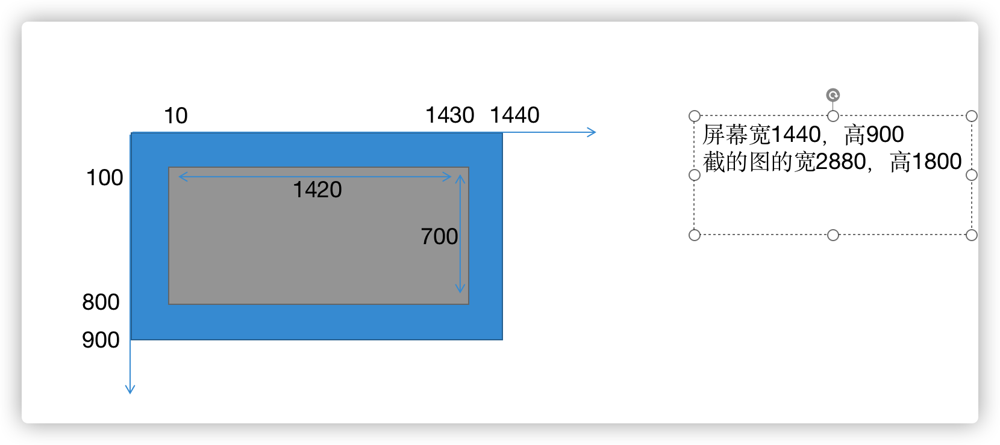
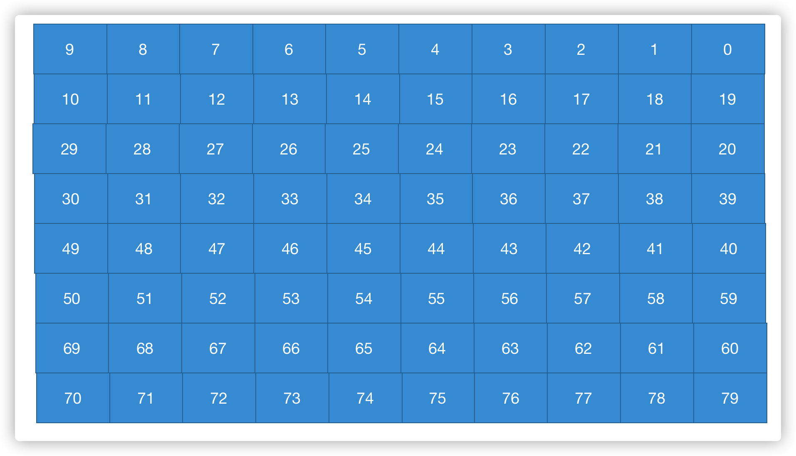

# AutoGenerateBigMap
generate a big map picture using automated testing tool

如何使用自动化测试工具生成一张大尺寸的地图图片，可以参考这个项目。

这个项目是使用pyautogui库模拟鼠标移动和拖拽的操作，移动地图软件，每移动一次，就截图保存。最后再将所有图片拼接成一张大尺寸图。

使用的环境是macbook Air，使用的地图软件是mac自带的地图软件，由于地图软件上下都有一部分多余的信息，拼接的时候这些东西需要去除，所以全屏截下来的图需要截一下，左右各留x_margin大小，上下各留y_margin大小。

这里设置x_margin=10,y_margin=100，灰色表示截取过后有效的地图大小。

另外macbook的屏幕宽高是1440*900，但是接下来的图的宽高是2880*1800，宽高都是两倍的关系。

用8*10张图片拼接的过程如下：

